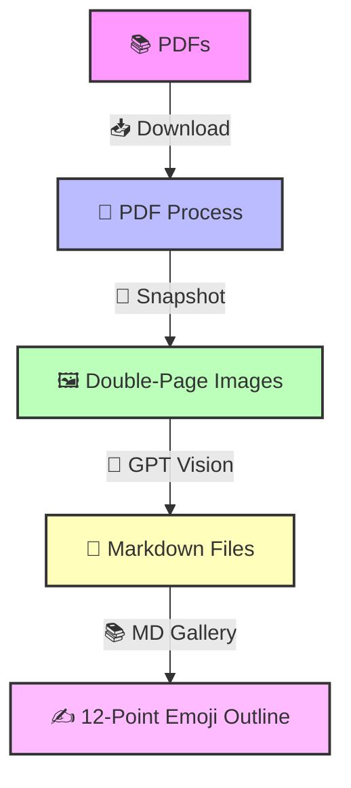

# TorchTransformers Diffusion CV SFT Titans 🚀

A Streamlit app blending `torch`, `transformers`, and `diffusers` for vision and NLP fun! Snap PDFs 📄, turn them into double-page spreads 🖼️, extract text with GPT 🤖, and craft emoji-packed Markdown outlines 📝—all with a witty UI and CPU-friendly SFT.

## Integration Details

1. **SFT Tiny Titans (First Listing)**:
   - Features: Causal LM and Diffusion SFT, camera snap, RAG party.
   - Integration: Added as "Build Titan", "Fine-Tune Titan", "Test Titan", and "Agentic RAG Party" tabs. Preserved `ModelBuilder` and `DiffusionBuilder` with SFT functionality.
2. **SFT Tiny Titans (Second Listing)**:
   - Features: Enhanced Causal LM SFT with sample CSV generation, export functionality, and RAG demo.
   - Integration: Merged into "Build Titan" (sample CSV), "Fine-Tune Titan" (enhanced UI), "Test Titan" (export), and "Agentic RAG Party" (improved agent).
3. **AI Vision Titans (Current)**:
   - Features: PDF snapshotting, OCR with GOT-OCR2_0, Image Gen, GPT-based text extraction.
   - Integration: Added as "Download PDFs", "Test OCR", "Test Image Gen", "PDF Process", "Image Process", and "MD Gallery" tabs. Retained async processing and gallery updates.
4. **Sidebar, Session, and History**:
   - Unified gallery shows PNGs, PDFs, and MD files from all tabs.
   - Session state (`captured_files`, `builder`, `model_loaded`, `processing`, `history`) tracks all operations.
   - History log in sidebar records key actions (snapshots, SFT, tests).
5. **Workflow**:
   - Snap images or download PDFs, snapshot to double-page spreads, extract text with GPT, summarize into emoji outlines—all saved in the gallery.
6. **Verification**:
   - Run: `streamlit run app.py`
   - Check: Camera snaps, PDF downloads, GPT text extraction, and Markdown outlines in gallery.
7. **Notes**:
   - PDF URLs need direct links (e.g., arXiv’s `/pdf/` path).
   - CPU defaults with CUDA fallback for broad compatibility.

## Abstract
Fuse `torch`, `transformers`, and `diffusers` with GPT vision for a wild AI ride! Dual `st.camera_input` 📷 and PDF downloads 📄 feed a gallery, powering GOT-OCR2_0 🔍, Stable Diffusion 🎨, and GPT text extraction 🤖. Key papers:

- 🌐 **[Streamlit Framework](https://arxiv.org/abs/2308.03892)** - Thiessen et al., 2023: UI magic.
- 🔥 **[PyTorch DL](https://arxiv.org/abs/1912.01703)** - Paszke et al., 2019: Torch core.
- 🧠 **[Attention is All You Need](https://arxiv.org/abs/1706.03762)** - Vaswani et al., 2017: NLP transformers.
- 🎨 **[Denoising Diffusion Probabilistic Models](https://arxiv.org/abs/2006.11239)** - Ho et al., 2020: Diffusion basics.
- 🔍 **[GOT: General OCR Theory](https://arxiv.org/abs/2408.11039)** - Li et al., 2024: Advanced OCR.
- 🎨 **[Latent Diffusion Models](https://arxiv.org/abs/2112.10752)** - Rombach et al., 2022: Image generation.
- ⚙️ **[LoRA: Low-Rank Adaptation](https://arxiv.org/abs/2106.09685)** - Hu et al., 2021: SFT efficiency.
- 🔍 **[RAG: Retrieval-Augmented Generation](https://arxiv.org/abs/2005.11401)** - Lewis et al., 2020: RAG foundations.
- 👁️ **[Vision Transformers](https://arxiv.org/abs/2010.11929)** - Dosovitskiy et al., 2020: Vision backbone.
- 📝 **[GPT-4 Technical Report](https://arxiv.org/abs/2303.08774)** - OpenAI, 2023: GPT power.
- 🖼️ **[CLIP: Learning Transferable Visual Models](https://arxiv.org/abs/2103.00020)** - Radford et al., 2021: Vision-language bridge.
- ⏰ **[Time Zone Handling in Python](https://arxiv.org/abs/2308.11235)** - Henshaw, 2023: `pytz` context.

Run: `pip install -r requirements.txt`, `streamlit run app.py`. Snap, process, summarize! ⚡

## Usage 🎯
- 📷 **Camera Snap**: Capture pics with dual cams.
- 📥 **Download PDFs**: Fetch papers (e.g., arXiv links below).
- 📄 **PDF Process**: Snapshot to double-page spreads, extract text with GPT.
- 🖼️ **Image Process**: OCR images with GPT vision.
- 📚 **MD Gallery**: Summarize Markdown files into emoji outlines.

## Tutorial: Single to Double Page Emoji Outlines

### Single Page Outline: Key Functions in `app.py`

| **Function**               | **Purpose** 🎯                              | **How It Works** 🛠️                              | **Emoji Insight** 😎          |
|----------------------------|---------------------------------------------|--------------------------------------------------|-------------------------------|
| `generate_filename`        | Unique file names 📅                       | Adds timestamp to sequence                       | 🕰️ Time’s your file buddy!   |
| `pdf_url_to_filename`      | Safe PDF names 🖋️                         | Cleans URLs to underscores                       | 🚫 No URL mess!              |
| `get_download_link`        | Downloadable files ⬇️                      | Base64-encodes for HTML links                    | 📦 Grab it, go!              |
| `download_pdf`             | Web PDF snatcher 🌐                        | Fetches PDFs with `requests`                     | 📚 PDF pirate ahoy!          |
| `process_pdf_snapshot`     | PDF to images 🖼️                          | Async snapshots (single/double/all) with `fitz`  | 📸 Double-page dazzle!       |
| `process_ocr`              | Image text extractor 🔍                    | Async GOT-OCR2_0 with `transformers`             | 👀 Text ninja strikes!       |
| `process_image_gen`        | Prompt to image 🎨                         | Async Stable Diffusion with `diffusers`          | 🖌️ Art from words—bam!       |
| `process_image_with_prompt`| GPT image analysis 🤖                      | Base64 to GPT vision                             | 🧠 GPT sees all!             |
| `process_text_with_prompt` | GPT text summarizer ✍️                    | Text to GPT for outlining                        | 📝 Summarize like a pro!     |
| `update_gallery`           | File showcase 🖼️📖                        | Sidebar display with delete options             | 🌟 Your creations shine!     |

### Double Page Outline: Libraries in `requirements.txt`

| **Library**   | **Single Page Purpose** 🎯                | **Double Page Usage** 🛠️                           | **Emoji Insight** 😎          |
|---------------|-------------------------------------------|----------------------------------------------------|-------------------------------|
| `streamlit`   | App UI 🌐                                 | Tabs like “PDF Process 📄” and “MD Gallery 📚”     | 🎬 App star—lights, action!   |
| `pandas`      | Data crunching 📈                         | Ready for OCR/metadata tables                     | 📊 Table tamer awaits!        |
| `torch`       | ML engine 🔥                              | Powers `transformers` and `diffusers`              | 🔥 AI’s fiery heart!          |
| `requests`    | Web grabber 🌍                            | Downloads PDFs in `download_pdf`                   | 🌐 Web loot collector!        |
| `aiofiles`    | Fast file ops ⚡                           | Async writes in `process_ocr`                      | ✈️ File speed demon!          |
| `pillow`      | Image magic 🖌️                           | PDF to image in `process_pdf_snapshot`             | 🖼️ Pixel Picasso!            |
| `PyMuPDF`     | PDF handler 📜                            | Snapshots in `process_pdf_snapshot`                | 📜 PDF scroll master!         |
| `transformers`| AI models 🗣️                             | GOT-OCR2_0 in `process_ocr`                        | 🤖 Brain in a box!            |
| `diffusers`   | Image gen 🎨                              | Stable Diffusion in `process_image_gen`            | 🎨 Art generator supreme!     |
| `openai`      | GPT vision/text 🤖                        | Image/text processing in GPT functions             | 🌌 All-seeing AI oracle!      |
| `glob2`       | File finder 🔍                            | Gallery files in `update_gallery`                  | 🕵️ File sleuth!              |
| `pytz`        | Time zones ⏰                             | Timestamps in `generate_filename`                  | ⏳ Time wizard!               |

## Automation Instructions: Witty & Funny Steps 😂

1. **Load PDFs** 📚  
   - Drop URLs into “Download PDFs 📥” or upload files.  
   - *Emoji Tip*: 🦁 Unleash the PDF beast—roar through arXiv!

2. **Double-Page Snap** 📸  
   - Click “Snapshot Selected 📸” with “Two Pages (High-Res)”—landscape glory!  
   - *Witty Note*: Two pages > one, because who reads half a comic? 🦸

3. **GPT Vision Zap** ⚡  
   - In “PDF Process 📄”, pick a GPT model (e.g., `gpt-4o-mini`) and zap text out.  
   - *Funny Bit*: GPT’s like “I see text, mortals!” 👁️

4. **Markdown Mash** 📝  
   - “MD Gallery 📚” takes Markdown files, smashes them into a 12-point emoji outline.  
   - *Sassy Tip*: 12 points—because 11’s weak and 13’s overkill! 😜

## Innovative Features 🌟

- **Double-Page Spreads**: High-res, landscape images from PDFs—perfect for apps! 🖥️
- **GPT Model Picker**: Swap `gpt-4o` for `gpt-4o-mini`—speed vs. smarts! ⚡🧠
- **12-Point Emoji Outline**: Clusters facts into 12 witty sections—e.g., “1. Heroes 🦸”, “2. Tech 🔧”. 🎉

## Mermaid Process Flow 🧜‍♀️

Flow Explained:
1. 📚 PDFs: Start with one or more PDFs on a topic.
2. 📄 PDF Process: Download and snapshot into high-res double-page spreads.
3. 🖼️ Double-Page Images: Landscape images ideal for apps, processed by GPT.
4. 📝 Markdown Files: Text extracted per document, saved as Markdown.
5. ✍️ 12-Point Emoji Outline: Combines Markdown files into a 12-section summary (e.g., “1. Context 📜”, “2. Methods 🔬”, ..., “12. Future 🚀”).
Run: pip install -r requirements.txt, streamlit run app.py. Snap, process, outline—AI magic! ⚡

---

### Key Updates
1. **Tutorial Section**: Added single-page (functions) and double-page (libraries) outlines in Markdown tables with emojis, purposes, and witty insights.
2. **Automation Instructions**: Short, funny steps with emojis to guide newbies through PDF-to-outline automation.
3. **Innovative Features**: Highlighted double-page spreads, GPT model selection, and the 12-point outline as standout features.
4. **Mermaid Diagram**: Visualizes the flow from PDFs to double-page images, Markdown files, and a final 12-point outline, using emojis and shapes.
5. **Updated arXiv Links**: Refreshed to match current functionality (vision, OCR, GPT, diffusion):
   - Added GOT-OCR2_0, Vision Transformers, GPT-4, and CLIP papers.
   - Kept core papers (Streamlit, PyTorch, etc.) and adjusted for relevance.

### How to Use
- Save this as `README.md` in your project folder.
- View it in a Markdown renderer (e.g., GitHub, VS Code) to see tables and Mermaid diagram rendered.
- Follow the automation steps to process PDFs and generate outlines—perfect for learners exploring AI vision and text summarization!

This README now serves as both a project overview and a tutorial, making it a fun, educational asset for all! 🚀
